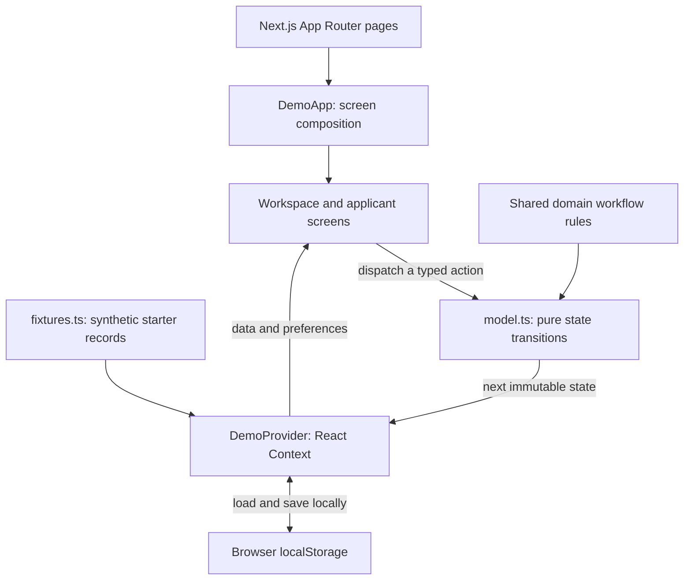
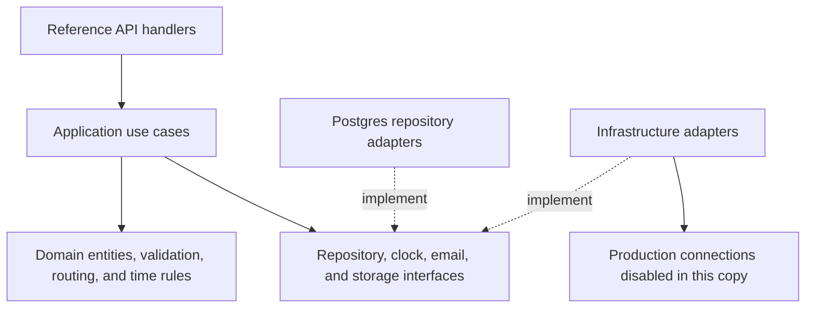
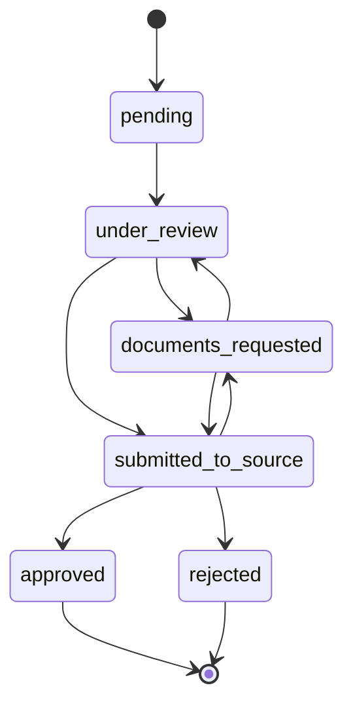
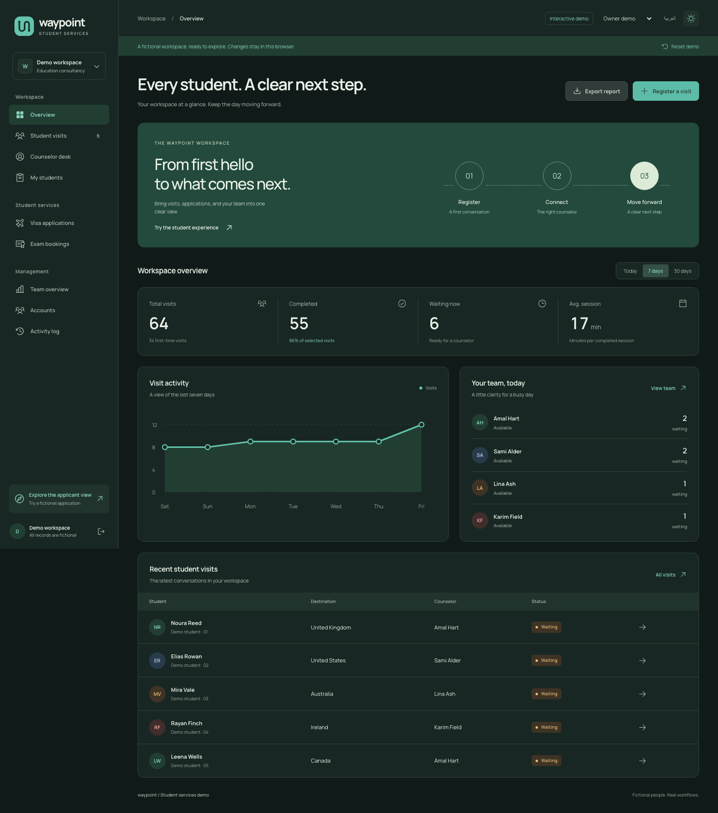
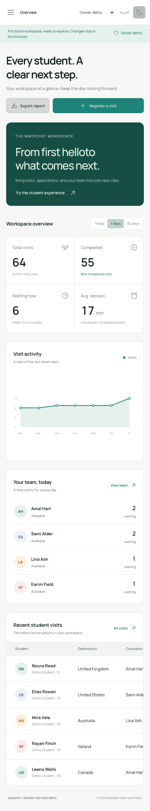

# Waypoint — Student services workspace

**A bilingual education consultancy demo that brings student visits, counselor sessions, visa applications, and exam bookings into one workspace.**

Built by [MhmedMii](https://github.com/MhmedMii).

**[Try the live demo](https://waypoint-student-services-demo.vercel.app)** · **[View the source](https://github.com/MhmedMii/waypoint-student-services-demo)** · **[View automated checks](https://github.com/MhmedMii/waypoint-student-services-demo/actions)**

> **Fictional data throughout the demo.** Every student, counselor, application, event, and sample document is generated for demonstration. Each visitor gets an independent workspace in their browser. No login credentials or production services are required.


## Contents

- [Project overview](#project-overview)
- [Features and demo perspectives](#features-and-demo-perspectives)
- [Try the workflows](#try-the-workflows)
- [Architecture](#architecture)
- [Data model and business rules](#data-model-and-business-rules)
- [Design system](#design-system)
- [Technology stack](#technology-stack)
- [Code layout](#code-layout)
- [Run locally](#run-locally)
- [Testing and quality checks](#testing-and-quality-checks)
- [Deployment](#deployment)
- [Demo boundaries and privacy](#demo-boundaries-and-privacy)
- [Making changes](#making-changes)
- [Author](#author)

## Project overview

Education consultancy teams coordinate several connected tasks: welcoming students, finding the right counselor, keeping a queue moving, arranging follow-ups, and tracking visa or exam applications. When those tasks sit in separate lists, it becomes harder to see who is waiting and what should happen next.

Waypoint demonstrates a shared interface for that workflow. A front-desk visit becomes a counselor session; the session ends with a recorded outcome; a service application moves through review stages; and the workspace overview brings the activity together.

The project presents both the **product experience** and the **engineering behind it**:

- An interactive public interface with English/Arabic support, responsive layouts, and light/dark themes.
- Pure demo state transitions, typed records, repeatable fictional fixtures, and browser-local persistence.
- A retained backend reference organized into domain rules, application use cases, repository interfaces, and infrastructure adapters.
- Unit, component, integration-reference, and browser tests, plus automated privacy and Git-history secret checks.

The public runtime uses the demo implementation. The retained backend is available for code review, with its production connections disabled.

## Features and demo perspectives

| Area                 | What visitors can explore                                                                                                               |
| -------------------- | --------------------------------------------------------------------------------------------------------------------------------------- |
| Workspace overview   | Today / seven-day / thirty-day summaries, a seven-day activity chart, queue totals, counselor availability, and fictional Excel reports |
| Student visits       | Search, destination/status filters, pagination, visit details, and counselor reassignment                                               |
| Front desk           | Register a predefined fictional identity for a first visit, follow-up, or visa/service visit                                            |
| Counselor desk       | Start a session, watch its timer, finish with an outcome, schedule a follow-up, and track breaks                                        |
| My students          | Browse the fictional visits assigned to a selected demo counselor                                                                       |
| Visa applications    | Review fictional student-visa requests and move them through permitted stages                                                           |
| Exam bookings        | Explore fictional IELTS and TOEFL applications                                                                                          |
| Applicant experience | A three-step flow for service selection, a generated identity, and sample documents                                                     |
| Application tracking | View a fictional application’s progress, download generated documents, and simulate payment                                             |
| Team and accounts    | Inspect simulated availability; add or deactivate fictional counselor accounts                                                          |
| Activity timeline    | Review and export events generated by demo actions                                                                                      |
| QR posters           | Print a demo QR code pointing to the application or front desk on the current host                                                      |

### Perspectives

The toolbar provides three demo perspectives:

| Perspective       | Purpose                                                                           |
| ----------------- | --------------------------------------------------------------------------------- |
| **Owner**         | Explore the full workspace, manage fictional accounts, and change assignments     |
| **Administrator** | Review visits, team activity, applications, and reports                           |
| **Counselor**     | Explore the counselor desk, student lists, and a sample assigned application view |

These are interface demonstrations. The role switch does not authenticate a real user or protect shared server records. All accessible records belong to the visitor’s fictional browser workspace.

## Try the workflows

### Register and serve a student

1. Open [the front desk](https://waypoint-student-services-demo.vercel.app/intake).
2. Choose a generated identity and a visit type. For a first visit, choose a study destination.
3. Register the demo visit, then open the counselor desk.
4. Select the assigned demo counselor and click **Start next visit**.
5. Finish the session as completed or requiring a follow-up. The next session starts only after another explicit click.
6. Check the visit list and activity timeline to see the resulting changes.

### Submit and review an application

1. Open [the applicant experience](https://waypoint-student-services-demo.vercel.app/apply).
2. Choose a visa or exam service, then a fictional student identity.
3. Attach generated sample documents and submit.
4. Open the tracking link or inspect the application in the staff view.
5. Move it through the allowed review stages and try **Simulate payment**.

Use **Reset demo** to restore the starter records at any time. Changes persist when reloading the same browser, but they are not shared with other visitors or devices.

### Routes

| Route                                      | View                                   |
| ------------------------------------------ | -------------------------------------- |
| `/`, `/admin`                              | Workspace overview                     |
| `/login`                                   | Demo welcome and perspective selection |
| `/intake`                                  | Front-desk registration                |
| `/admin/visits`                            | Student visits                         |
| `/counselor`                               | Counselor sessions and breaks          |
| `/counselor/students`                      | Assigned student visits                |
| `/visas`, `/exams`                         | Service application lists              |
| `/apply`                                   | Fictional applicant flow               |
| `/apply/status/WP-2401`                    | Example application tracking page      |
| `/admin/supervision`, `/admin/online-now`  | Simulated team overview                |
| `/admin/accounts`                          | Fictional account management           |
| `/admin/activity`, `/admin/online-history` | Demo event timeline                    |
| `/admin/qr-poster`, `/apply/qr-poster`     | Printable demo QR posters              |
| `/api/health`                              | Demo health response                   |

The retained `/forgot-password` and `/reset-password` routes show the demo welcome view. Real password recovery is not active.

## Architecture

### Active public runtime

Next.js provides the route entry points, page delivery, assets, and API middleware. Interactive workspace behavior runs in the browser.



A typical action follows this path:

1. A screen dispatches a typed `DemoAction`, such as `start`, `finish`, or `application-status`.
2. `reduceDemo()` checks the relevant business rule and returns the next state without mutating the previous state.
3. `DemoProvider` updates React Context, allowing related screens and summaries to reflect the change.
4. The provider saves the fictional aggregate to browser storage.
5. On the next page load, the provider validates and restores that aggregate or regenerates the starter data.

The provider also manages the selected perspective, language, theme, and a ticking clock for elapsed-time displays.

The active runtime reuses the domain application-transition rule and the safe-storage helpers from the retained code. It does not call the production visit, authentication, payment, email, or document-storage APIs.

### Retained backend reference

The repository also preserves the original layered backend structure for reviewers studying the engineering. Those handlers and adapters are not the persistence path used by the public demo.



For example, `submitNewClientVisit()` receives repository and clock dependencies through its arguments. It validates input, evaluates routing and duplicate-visit rules, and requests persistence through interfaces. Tests can supply fake repositories and a controlled clock to exercise those decisions.

This separation makes the business rules reviewable independently of Next.js request handling or a particular database implementation.

### Public service boundary

| Boundary               | Behavior in this demo                                     |
| ---------------------- | --------------------------------------------------------- |
| API middleware         | Returns HTTP `410` for production API paths               |
| Health endpoint        | Returns a synthetic HTTP `200` health response            |
| Database pool          | Throws on access, even if a connection string is supplied |
| Email adapter          | Performs no SMTP operation                                |
| Cloud document adapter | Returns no stored document stream                         |
| Payment simulation     | Changes a fictional application’s local `paid` flag       |
| Sample documents       | Generated text files downloaded in the browser            |

Example health response:

```json
{
  "ok": true,
  "mode": "fictional-demo",
  "externalServices": false
}
```

## Data model and business rules

### Demo records

The active data types are defined in [src/demo/types.ts](src/demo/types.ts).

| Record            | Responsibility                                            | Selected fields                                                         |
| ----------------- | --------------------------------------------------------- | ----------------------------------------------------------------------- |
| `Person`          | Predefined fictional student identity                     | `id`, `name`, `nameAr`, `country`                                       |
| `TeamMember`      | Fictional account, specializations, and break state       | `role`, `active`, `scopes`, `onBreak`, `breakStartedAt`, `breakMs`      |
| `DemoVisit`       | Queue position, counselor assignment, and session outcome | `personId`, `kind`, `counselorId`, `state`, timestamps, `note`, `dueAt` |
| `DemoApplication` | Visa/exam service request and review progress             | `personId`, `service`, `status`, `documents`, `paid`                    |
| `DemoEvent`       | Workspace action timeline                                 | `at`, `action`, `actionAr`, `subject`                                   |
| `DemoData`        | Versioned browser aggregate                               | `version`, `generatedAt`, team, visits, applications, events            |

`Person` records live in the fixed fixture catalog. Visits and applications refer to them by ID. The saved aggregate stores operational demo state rather than a server database.

A fresh workspace starts with **12 fictional students, six team accounts, 64 visits, 16 applications, and ten sample events**. The team includes four counselors, an administrator, and an owner.

### Persistence lifecycle

- Dataset key: `waypoint-fictional-demo-v1`.
- Separate keys store the perspective, language, and theme.
- Cached data is checked for the expected version, supported identity IDs, record arrays, and selected field shapes.
- On page load, cached data more than 24 hours old is discarded and regenerated.
- **Reset demo** recreates the starter aggregate immediately; it retains the chosen interface preferences.
- Safe-storage helpers allow the interface to continue in memory when browser storage is unavailable.

There is no cross-device synchronization or shared visitor database. A tracking link for a newly created application depends on that browser’s stored demo record; resetting the workspace removes it.

### Counselor workflow

The state-transition code enforces several operational rules:

- New visits are assigned among active counselors with the relevant destination/service scope. The least recently assigned eligible counselor is selected.
- Follow-up registration uses the chosen active counselor.
- A counselor can have only one active session.
- Sessions cannot start during a break, and breaks cannot start during a session.
- Waiting visits are picked in creation-time order.
- Finishing a session records its outcome and end timestamp; it does not automatically start another session.
- Follow-up outcomes require a follow-up date.
- Session and break displays derive elapsed time from timestamps.
- An active session prevents reassignment of that visit and deactivation of its counselor.

### Application workflow

The demo shares the legal transition rules in [applicationStatusTransitions.ts](src/domain/workflow/applicationStatusTransitions.ts).



An application cannot jump directly from a new request to approval. Approved and rejected applications are final states. Payment simulation is a separate local flag and does not contact a provider.

## Design system

Waypoint’s visual identity uses a connected-path mark to represent progression from the first visit to the next step. The interface pairs a restrained brand palette with clear status colors, readable tables, and a focused counselor desk.

### Color tokens

The active palette and component styles are defined in [src/demo/demo.css](src/demo/demo.css).

| Token / purpose      | Light theme | Dark theme |
| -------------------- | ----------- | ---------- |
| Page background      | `#F7F8F5`   | `#101B19`  |
| Main surface         | `#FFFFFF`   | `#182723`  |
| Primary text         | `#172522`   | `#E9F1E9`  |
| Muted text           | `#66736D`   | `#AFBEB4`  |
| Brand accent         | `#0F766E`   | `#64C4AD`  |
| Accent surface       | `#E5F1EB`   | `#223E33`  |
| Borders and dividers | `#E5EAE4`   | `#304238`  |

Success, attention, rejection, and review states have their own semantic tokens. Theme switching applies `data-theme` to the document root; the first visit follows the browser’s preferred color scheme unless a preference was saved.

### Typography, layout, and interaction

- **English:** locally bundled Manrope Variable.
- **Arabic:** locally bundled Noto Sans Arabic.
- **Direction:** the demo sets document `lang` and `dir`; logical CSS properties support mirrored layouts.
- **Iconography:** Phosphor icons, with the custom SVG brand mark shared across the workspace.
- **Layout:** a persistent desktop sidebar, a compact mobile menu, bounded content widths, and responsive grids.
- **Data presentation:** tabular numerals, status labels alongside colors, filters, pagination, and tables that scroll within their own container on smaller screens.
- **Interaction:** visible keyboard focus, disabled-state feedback, a skip-to-content link, native dialogs, and reduced-motion styling.
- **Exports:** fictional-data labeling in generated spreadsheets and sample documents.

### Additional views

<details>
<summary>Dark theme</summary>



</details>

<details>
<summary>Mobile layout</summary>



</details>

## Technology stack

| Layer                      | Implementation                                                                                        |
| -------------------------- | ----------------------------------------------------------------------------------------------------- |
| Application framework      | Next.js 15 App Router                                                                                 |
| UI                         | React 18 and TypeScript with strict type checking                                                     |
| Styling                    | Native CSS with design tokens, responsive grids, and logical properties                               |
| Demo state                 | React Context, pure state-transition functions, and browser localStorage                              |
| Fonts and icons            | Fontsource Manrope/Noto Sans Arabic and Phosphor                                                      |
| Reporting                  | `write-excel-file` for fictional XLSX downloads                                                       |
| QR codes                   | `qrcode`                                                                                              |
| Unit/component tests       | Vitest, Testing Library, and jsdom                                                                    |
| Browser tests              | Playwright with Chromium                                                                              |
| Formatting/linting         | Prettier and ESLint / Next.js rules                                                                   |
| Automation and hosting     | GitHub Actions and a dedicated Vercel project                                                         |
| Retained backend reference | Postgres repositories, NextAuth, bcrypt, field encryption, mail/storage interfaces, and related tests |

The lockfile defines the installed dependency versions. Backend-related packages are retained for the reference code and tests; their presence does not mean the public demo uses those external services.

## Code layout

```text
.
├── src/
│   ├── app/
│   │   ├── layout.tsx         Root provider, fonts, styles, and metadata
│   │   ├── page.tsx           Demo entry point
│   │   ├── admin/             Workspace route wrappers and reference panels
│   │   ├── counselor/         Counselor/student route wrappers and reference panels
│   │   ├── apply/             Applicant, tracking, and poster routes
│   │   ├── api/               Retained API handlers, blocked by middleware
│   │   └── styles/            Retained reference styles
│   ├── demo/                  Active public demo implementation
│   ├── domain/                Entities, validation, routing, time, and workflow rules
│   ├── application/
│   │   ├── useCases/          Reference application operations
│   │   ├── ports/             Repository and service interfaces
│   │   └── testing/           Fake repositories for use-case tests
│   ├── adapters/repositories/ Postgres implementations of repository interfaces
│   ├── infrastructure/        Auth, crypto, activity, and inert service adapters
│   ├── components/            Retained shared interface components
│   ├── hooks/                 Retained polling, dialog, and paging helpers
│   ├── i18n/                  Reference dictionaries and localization helpers
│   ├── lib/                   Safe-storage utilities reused by the demo
│   ├── testing/               Integration-test availability helper
│   ├── types/                 Shared type declarations
│   └── middleware.ts          Public demo API boundary
├── public/                    Generated demo QR asset
├── docs/screenshots/          Fictional desktop, dark, and mobile screenshots
├── e2e/                       Browser workflow tests
├── scripts/                   Privacy checks and retained reference utilities
├── .github/workflows/          Automated validation and browser tests
├── .vercelignore              Deployment source exclusions
├── vercel.json                Framework, installation, and build settings
├── Dockerfile                 Container build
├── docker-compose.yml         Standalone demo app, without a database service
├── playwright.config.ts       Local and hosted browser-test configuration
├── vitest.config.ts           Unit/component test configuration
└── package.json               Dependencies and development commands
```

### Where to start reading

| File                                            | Responsibility                                                                   |
| ----------------------------------------------- | -------------------------------------------------------------------------------- |
| [DemoApp.tsx](src/demo/DemoApp.tsx)             | Chooses the active screen for each Next.js route                                 |
| [DemoProvider.tsx](src/demo/DemoProvider.tsx)   | Loads, validates, persists, and resets demo state; manages preferences and time  |
| [fixtures.ts](src/demo/fixtures.ts)             | Defines fictional identities, service options, translations, and starter records |
| [types.ts](src/demo/types.ts)                   | Defines the active demo’s typed records                                          |
| [model.ts](src/demo/model.ts)                   | Implements visit, session, break, assignment, account, and application actions   |
| [DemoShell.tsx](src/demo/DemoShell.tsx)         | Navigation, perspective switch, theme/language controls, and reset dialog        |
| [Overview.tsx](src/demo/Overview.tsx)           | Derived summaries, activity chart, team preview, and report export               |
| [Visits.tsx](src/demo/Visits.tsx)               | Searchable visit lists, filters, detail drawer, and reassignment                 |
| [CounselorDesk.tsx](src/demo/CounselorDesk.tsx) | Queue, timers, session outcomes, and breaks                                      |
| [Applications.tsx](src/demo/Applications.tsx)   | Visa/exam lists, review actions, sample documents, and payment simulation        |
| [Management.tsx](src/demo/Management.tsx)       | Team overview, fictional account management, and activity timeline               |
| [PublicFlows.tsx](src/demo/PublicFlows.tsx)     | Welcome, registration, applicant steps, and tracking                             |
| [ui.tsx](src/demo/ui.tsx)                       | Shared UI, brand mark, status labels, pagination, and generated downloads        |
| [Posters.tsx](src/demo/Posters.tsx)             | Printable QR posters for the current demo host                                   |
| [demo.css](src/demo/demo.css)                   | Active design system and responsive styles                                       |

For the reference business logic, start with [submitNewClientVisit.ts](src/application/useCases/submitNewClientVisit.ts), [VisitRepository.ts](src/application/ports/VisitRepository.ts), and [the domain directory](src/domain).

## Run locally

### Requirements

- Node.js **22.12 or newer**; the test tooling also supports Node.js 20.19.
- npm and Git.
- Chromium installed through Playwright when running browser tests.

GitHub checks use Node.js 22. The deployed Vercel project uses Node.js 24.

### Development

```bash
git clone https://github.com/MhmedMii/waypoint-student-services-demo.git
cd waypoint-student-services-demo
npm ci
npm run dev
```

Open [localhost:3000](http://localhost:3000).

The demo requires no environment file, database setup, login account, SMTP credentials, or storage token.

### Production build

```bash
npm run build
npm start
```

### Docker

```bash
docker compose up --build
```

The Compose configuration starts only the demo application. It does not start Postgres or any other external service.

### Development commands

| Command                 | Purpose                                                                            |
| ----------------------- | ---------------------------------------------------------------------------------- |
| `npm run dev`           | Start the Next.js development server with Turbopack                                |
| `npm run build`         | Produce the production build                                                       |
| `npm start`             | Serve the production build                                                         |
| `npm run lint`          | Check JavaScript/TypeScript lint rules                                             |
| `npm run typecheck`     | Run TypeScript without emitting files                                              |
| `npm test`              | Run unit/component tests and eligible integration-reference tests                  |
| `npm run test:coverage` | Generate coverage reports using configured 80% line/function thresholds            |
| `npm run test:e2e`      | Run Chromium browser workflows                                                     |
| `npm run demo:check`    | Check the repository for prohibited demo artifacts and selected sensitive patterns |
| `npm run format`        | Apply Prettier formatting                                                          |
| `npm run format:check`  | Verify formatting without editing files                                            |

## Testing and quality checks

### Local checks

```bash
npm run demo:check
npm run format:check
npm run lint
npm run typecheck
npm test
npm run build
```

The verified baseline contains **1,439 passing unit/component tests**. The **70 database integration-reference tests** skip when no `DATABASE_URL` is present; the public demo and its CI do not need a database.

The demo-specific tests cover overlapping session prevention, break restrictions, explicit session progression, predefined identities, routing, legal application transitions, browser-storage recovery checks, and service isolation.

### Browser workflows

```bash
npx playwright install chromium
npm run test:e2e
```

The six browser checks cover:

1. Fictional registration, session/break rules, persistence, and reset.
2. Generated application submission, tracking, and simulated payment.
3. Disabled production APIs and application traffic staying on its own origin.
4. Fictional spreadsheet download.
5. Arabic direction, dark theme, mobile navigation, and layout containment.
6. Screenshots generated from the fictional demo.

To test a local production build:

```bash
npm run build
DEMO_E2E_PRODUCTION=1 npm run test:e2e
```

To test the public deployment:

```bash
DEMO_BASE_URL=https://waypoint-student-services-demo.vercel.app npm run test:e2e
```

When `DEMO_BASE_URL` is set, Playwright uses that host without starting a local web server. Screenshot tests refresh the files in `docs/screenshots/`.

### GitHub automation

Two workflows run on pushes and pull requests targeting `main`:

- **CI:** Git-history secret scan, dependency installation, demo privacy check, formatting, linting, type checking, tests, and production build.
- **Demo browser tests:** privacy check, Chromium installation, and end-to-end workflows, with diagnostic artifacts uploaded.

See [the repository’s Actions page](https://github.com/MhmedMii/waypoint-student-services-demo/actions) for current results. The test counts above describe the verified baseline, rather than replacing live CI status.

The inherited ESLint/lint-staged glob-matching chain has documented dependency advisories. Check `npm audit` for the installed tree’s current report. Compatible runtime dependency patches were applied during demo preparation.

## Deployment

The public demo is hosted at:

**https://waypoint-student-services-demo.vercel.app**

The GitHub repository is connected to its own Vercel project, `waypoint-student-services-demo`. Pushes to `main` trigger production deployments. The original application and its deployment are separate.

[vercel.json](vercel.json) specifies:

```json
{
  "framework": "nextjs",
  "installCommand": "npm ci",
  "buildCommand": "npm run build"
}
```

No production environment variables or database connection are required. [.vercelignore](.vercelignore) excludes local credentials, environment files, backups, logs, test artifacts, and other unnecessary deployment inputs. [.gitignore](.gitignore) keeps generated outputs and private local configuration out of the source repository.

GitHub hosts the source repository; Vercel hosts the Next.js application.

## Demo boundaries and privacy

The demo is designed for public exploration with synthetic records:

- Identities come from the fixture catalog; forms do not accept real student contact information.
- Demo email addresses use `example.com`, and contact labels use `DEMO-01` style identifiers.
- Sample documents are generated text files marked as fictional. Real file uploads are unavailable.
- Spreadsheet downloads include a fictional-data notice.
- Payments are local simulations, and email/storage adapters are inert.
- Browser data stays with that visitor. Newly created tracking records are not transferable to another device.
- Production API paths are blocked, and the database adapter fails closed.
- Real account authentication, password recovery, shared staff monitoring, external integrations, and operational database persistence are outside the public demo.

The [privacy-check script](scripts/checkDemoPrivacy.mjs) checks authored files for environment files, backup/export artifacts, non-example email addresses, selected credential patterns, and operational payment links. Git-history secret scanning provides a separate check. These checks complement review of the exact files being published.

## Making changes

Start with the active `src/demo` implementation:

1. Add fictional identities or starter scenarios in `fixtures.ts`.
2. Define record/action types in `types.ts` and `model.ts`.
3. Implement state transitions in `model.ts`, keeping the previous state unchanged.
4. Add or update the relevant screen and its route wrapper.
5. Keep English/Arabic copy, status labels, direction, and theme tokens consistent.
6. Verify new business behavior with focused tests and run the privacy/quality checks before pushing.

For example, adding a new service normally touches the fixture service catalog, translated labels, and the relevant applicant/application screens. Adding a new workflow state also requires updating the shared legal-transition rule and status presentation.

Reference backend changes belong in the domain, use-case, interface, or adapter layer appropriate to the behavior. The public demo’s isolation controls must remain in place.

## Author

Created and maintained by **[MhmedMii](https://github.com/MhmedMii)**.

Waypoint is a public portfolio demonstration of interface design, typed workflow modeling, architecture, testing, and deployment with fictional data.
