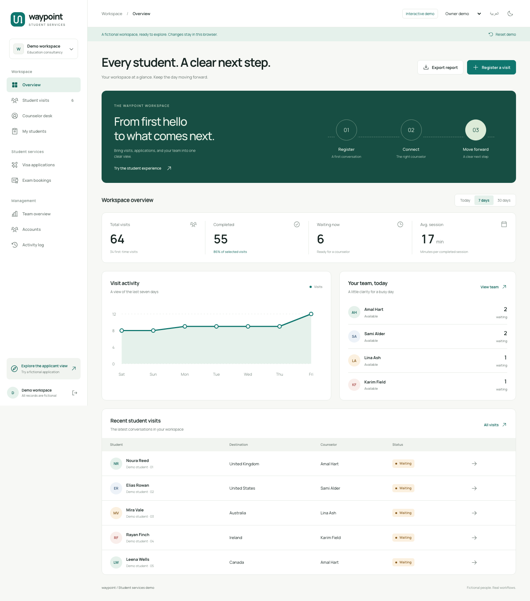

# Waypoint — Student services demo

A redesigned education consultancy workspace with **fictional people and working demo workflows**. Explore student visits, counselor queues, visa applications, exam bookings, team activity, and reports.

Built by [MhmedMii](https://github.com/MhmedMii).



## Run locally

Requires Node.js 20.19+ and npm.

```bash
npm ci
npm run dev
```

Open [localhost:3000](http://localhost:3000). No database, environment file, external account, or login credentials are required.

## Explore

| View                 | Route                                  | What to try                                                |
| -------------------- | -------------------------------------- | ---------------------------------------------------------- |
| Workspace overview   | `/` or `/admin`                        | Change report periods and export fictional data            |
| Demo welcome         | `/login`                               | Choose owner, administrator, or counselor perspectives     |
| Student visits       | `/admin/visits`                        | Search, filter, inspect, and reassign fictional visits     |
| Front desk           | `/intake`                              | Register a generated identity with automatic routing       |
| Counselor desk       | `/counselor`                           | Start a session, finish with an outcome, or take a break   |
| My students          | `/counselor/students`                  | Explore each demo counselor’s assigned visits              |
| Visa applications    | `/visas`                               | Review fictional applications through their allowed stages |
| Exam bookings        | `/exams`                               | Explore IELTS and TOEFL booking scenarios                  |
| Applicant experience | `/apply`                               | Submit a fictional application with generated documents    |
| Application tracking | `/apply/status/WP-2401`                | Track a fictional decision and simulate payment            |
| Team overview        | `/admin/supervision`                   | See simulated availability and queue activity              |
| Accounts             | `/admin/accounts`                      | Add or deactivate generated accounts in the owner view     |
| Activity timeline    | `/admin/activity`                      | Review and export simulated workspace events               |
| Demo QR posters      | `/admin/qr-poster`, `/apply/qr-poster` | Print QR codes pointing to this demo’s origin              |

Use the toolbar to switch between **English and Arabic**, **light and dark themes**, and demo roles. The administrator perspective offers reporting; the owner can manage fictional accounts and assignments. These are simulated product perspectives, not authentication boundaries.

## Fictional data and isolation

- All displayed students, staff, visits, applications, logs, and sample files are synthetic.
- Every demo email uses `example.com`. Contact identifiers are `DEMO-01` style labels, never callable phone numbers.
- Forms offer predefined fictional identities and generated text documents. They do not collect real personal information or accept real file uploads.
- Payments are simulated. No payment provider, SMTP server, database, or cloud document storage is connected.
- Changes live in this browser’s local storage. Visitors do not share records. **Reset demo** restores fresh fictional data, and stored scenarios automatically refresh after 24 hours.
- Production API paths return HTTP 410, apart from a local `/api/health` response. Database access also fails closed even if a connection string is supplied. Legacy mail and storage adapters are inert.
- Spreadsheet exports and downloaded sample documents are marked as fictional demo artifacts.
- No production database, uploaded files, credentials, or Git history were copied into this repository.

This copy is a portfolio/demo application. The original domain logic and unit tests are retained as reference; the active UI in `src/demo` uses a browser-only simulation. It is not configured to operate a real consultancy.

## Validation

```bash
npm run demo:check
npm run format:check
npm run lint
npm run typecheck
npm test
npm run build
```

Browser checks:

```bash
npx playwright install chromium
npm run test:e2e
```

Historical database integration tests skip without `DATABASE_URL`; the demo’s isolation, state transitions, and browser flows have separate tests that need no database.

The dependency audit still reports six advisories in the inherited ESLint / lint-staged glob-matching chain. Compatible runtime dependency patches, including Next.js, have been applied.

## Design and implementation

Next.js App Router, React, TypeScript, native CSS, locally bundled Manrope and Noto Sans Arabic, and Phosphor icons. The visual identity uses a connected-path logo, deep teal, soft ivory, and coordinated dark-theme surfaces.

```text
src/demo/                 Active fictional UI, fixtures, state transitions, and tests
src/app/                  Demo route entry points and retained reference components
src/domain/               Original validation and workflow logic
src/application/          Reference use cases and repository interfaces
src/infrastructure/       Reference adapters; production connections disabled
scripts/checkDemoPrivacy.mjs   Repository privacy checks
e2e/                      Demo browser tests
```

## GitHub and hosting

The public source repository is [MhmedMii/waypoint-student-services-demo](https://github.com/MhmedMii/waypoint-student-services-demo).

The demo deploys to a dedicated Vercel project named `waypoint-student-services-demo` in the `mhmedmiis-projects` scope. It requires no database, secrets, or production environment variables. This project is independent of the original application and its deployment.

Visitors receive a generated fictional datastore in their own browser. They can register sample visits, run counselor sessions, review applications, export fictional reports, simulate payments, and reset their own workspace. They cannot upload real documents or change another visitor’s records.

Deployment source excludes environment files, backups, data exports, logs, and local deployment credentials through `.vercelignore`. Updates to this repository can deploy automatically after connecting the dedicated project to GitHub.

Docker is also available:

```bash
docker compose up --build
```

GitHub hosts the source. This Next.js project requires a compatible application host for a live demo; it is not configured as a GitHub Pages static export.
